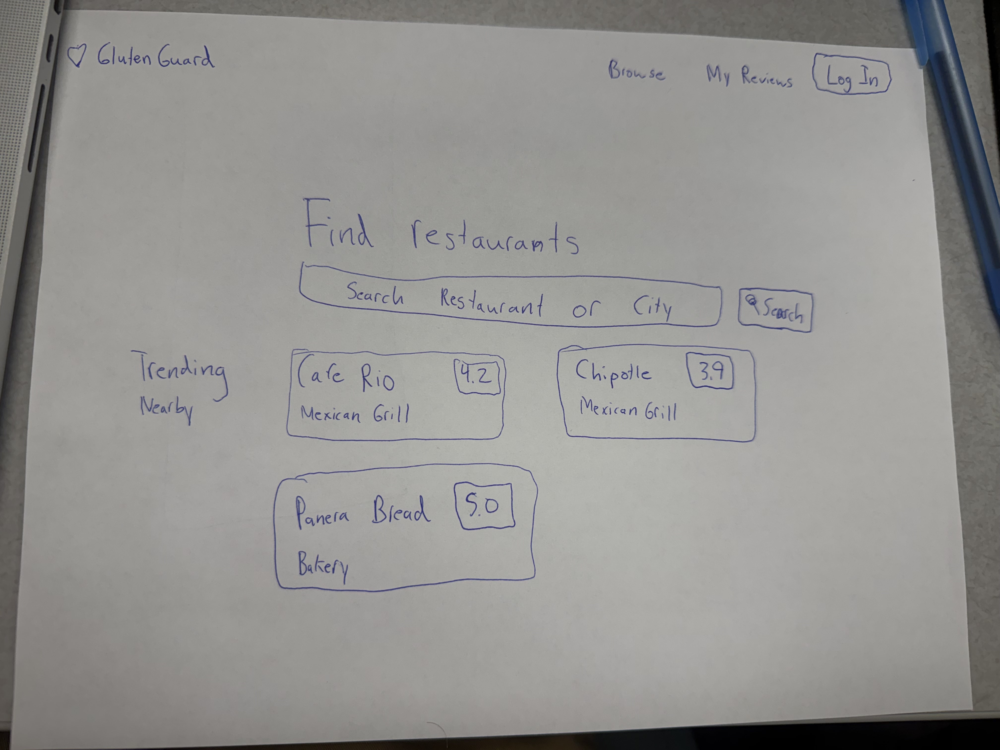

#GlutenGuard

[My Notes](notes.md)

Gluten Guard is a mobile/web app designed for users to share their experiences about how manageable different restaurants are about allergies and sensitivity to glutenous items. Users will be able to login/register and then search for the desired restaurant and fill out a review. The website will be integrated with google places/maps API to tie user review data to address/location so other users can view reviews. 

> [!NOTE]
> This is a template for your startup application. You must modify this `README.md` file for each phase of your development. You only need to fill in the section for each deliverable when that deliverable is submitted in Canvas. Without completing the section for a deliverable, the TA will not know what to look for when grading your submission. Feel free to add additional information to each deliverable description, but make sure you at least have the list of rubric items and a description of what you did for each item.

> [!NOTE]
> If you are not familiar with Markdown then you should review the [documentation](https://docs.github.com/en/get-started/writing-on-github/getting-started-with-writing-and-formatting-on-github/basic-writing-and-formatting-syntax) before continuing.

### Elevator pitch

Ever been out to eat with someone with a bad allergy? Growing up my mother and only sibling suffered from severe gluten allergies. I can still remember how painful it was to eat a restaurant where gluten was accidentally snuck into the food. A nice evening out suddenly turned into a day of painful sickness. GlutenGuard is a mobile/web service that helps people with celiac disease or gluten sensitivity find restaurants they can actually trust. Not just dining locations with a gluten-free item on the menu, but ones with practices that prevent cross-contamination. Users search for a restaurant and see or submit reviews answering questions a typical review site never asks. For example, does the kitchen use a separate fryer or grill? Is there a dedicated gluten-free prep area? How confident would someone with celiac disease feel eating here versus someone who's just gluten-sensitive? After answering these questions: other people who struggle with the same troubles of finding reliable gluten free vendors will be able to view and share their own reviews. All this goes to helping and protecting the ones we love most while still maintaining the magic of a going out to eat a meal.

### Design

Diagram highlights the search bar with google maps/google places API integrated. Users use the already large library to ping their reviews to the address associated with the restaurant. Easy to use homepage with header that includes a way to login/logout. Only two other links that let users browse different reviews from a map or view their previous reviews from other dining locations.

### Key features

- **Gluten-free safety search** — Search any restaurant via the Google Places API and see a GF safety profile. This includes whether they use a separate grill/fryer, have a dedicated GF menu, and an aggregated cross-contamination rating.
- **Structured community reviews** — Logged-in users submit detailed GF reviews (not just star ratings) covering kitchen practices, and can browse, edit, or delete their own review history.
- **Real-time activity feed** — WebSocket-powered live updates show how many people are currently viewing a restaurant and push new reviews to everyone on that page instantly, without a refresh.

### Technologies

I am going to use the required technologies in the following ways.

- **HTML** - Mobile friendly homepage, a restaurant search page, a restaurant detail/review page, a review submission form, and a login/register page that prompts upon opening the site (can be skipped if just wanting to browse). Explicitly mobile friendly.
- **CSS** - User friendly styling that is designed to work with both mobile and desktop views. Consistent styling for review indicators (color-coded cross-contamination ratings).
- **React** - Components for restaurant search-as-you-type, restaurant detail view with aggregated gluten free stats, a review submission form, and a live viewer/review feed that updates via WebSocket without a page reload.
- **Service** - A backend with endpoints for authentication (register/login/logout/session check). Includes app-specific functionality like utilizing Google Places API (LINK TO API: https://developers.google.com/maps/documentation/places/web-service/overview) to search for specific locations, fetching/caching restaurant data, and creating/editing/deleting gluten-free reviews. 
- **DB/Login** - Three main categories: users, review, and restaurants. Login is required to submit a review but any user can browse. Users table includes a secure way to do auths and store username and passwords.
- **WebSocket** - Real-time broadcast of new reviews (and updated average rating) to everyone viewing that restaurant's page.

## 🚀 Specification Deliverable

> [!NOTE]
> Fill in this sections as the submission artifact for this deliverable. You can refer to this [example](https://github.com/webprogramming260/startup-example/blob/main/README.md) for inspiration.

For this deliverable I did the following. I checked the box `[x]` and added a description for things I completed.

- [X] I completed the prerequisites for this deliverable (Git commit requirement)
- [X] Proper use of Markdown
- [X] A concise and compelling elevator pitch
- [X] Description of key features
- [X] Description of how you will use each technology including your 3rd party API and use of WebSocket
- [X] One or more rough sketches of your application. Images must be embedded in this file using Markdown image references.

## 🚀 AWS deliverable

For this deliverable I did the following. I checked the box `[x]` and added a description for things I completed.

- [X] **Rented EC2 server** - I did not complete this part of the deliverable.
- [X] **Leased domain name** - I did not complete this part of the deliverable.
- [X] **Server accessible** from my domain: [https://glutenguard.click/](https://glutenguard.click/) - I did complete this part of the deliverable.

## 🚀 HTML deliverable

For this deliverable I did the following. I checked the box `[x]` and added a description for things I completed.

- [X] I completed the prerequisites for this deliverable (Simon deployed, GitHub link, Git commits). Simon is deployed to [simon.glutenguard.click](https://simon.glutenguard.click), every page footer links to this GitHub repository, and the work is spread across multiple commits.
- [X] **HTML pages** - Five pages: `index.html` (home, search, and login), `browse.html` (map and reviewed restaurants), `restaurant.html` (a restaurant's gluten-free safety profile and reviews), `review.html` (review form), and `my-reviews.html` (the logged-in user's review history).
- [X] **Proper HTML element usage** - Every page uses `header`, `nav`, `main`, `section`, and `footer`. Forms use `label`, `fieldset`, `legend`, `select`, radio buttons, a checkbox, `textarea`, and a file input. Tabular data is in `table` elements with `thead` and `tbody`.
- [X] **Links** - Every page has nav links to Home, Browse Reviews, and My Reviews. Restaurant names link to the restaurant page, the restaurant page links to the review form, and My Reviews has Edit and Delete links.
- [X] **Text** - Each page explains its purpose. The restaurant page summarizes kitchen practices (separate fryer, separate grill, GF menu, staff training) and shows written reviews.
- [X] **3rd party API placeholder** - The home page search results, the browse page map, and the restaurant name, address, and hours are marked as coming from the Google Places and Google Maps APIs.
- [X] **Images** - The browse page has a placeholder map image, and My Reviews shows two meal photos with the Backdoor Burger review.
- [X] **Login placeholder** - The home page has an email and password form with Login and Create Account buttons. Each page header shows the current username, and My Reviews shows the signed-in user with a Logout link.
- [X] **DB data placeholder** - The reviewed restaurants table, the restaurant reviews and aggregated ratings, and the My Reviews history are all marked as data stored in and loaded from the database.
- [X] **WebSocket placeholder** - The restaurant page's Live activity section (viewer count and new reviews), the browse page's Recent activity feed, and the My Reviews notifications are marked as real-time WebSocket updates.

## 🚀 CSS deliverable

For this deliverable I styled the application with Bootstrap and my own `main.css`, which every page loads after Bootstrap so my rules take priority.

- [X] I completed the prerequisites for this deliverable (Simon deployed, GitHub link, Git commits). Simon CSS is deployed to [simon.glutenguard.click](https://simon.glutenguard.click), every page footer links to this GitHub repository, and the styling is spread across multiple commits (base styles, header/footer, home layout, home colors, browse layout, rating badges, restaurant layout, restaurant colors, review form layout, review form colors, My Reviews, and a final polish and overflow fix).
- [X] **Visually appealing colors and layout. No overflowing elements.** - A green and cream palette is defined once as CSS variables in `:root` and used everywhere. The home page has a gradient hero banner and white cards with a shadow and a colored top border. Cross-contamination ratings are color-coded pill badges: green for safe, amber for caution, and red for risk. Yes/No answers are colored the same way. On the restaurant page, each kitchen practice in the safety profile gets a colored ✓ (yes), ~ (usually), or ✗ (no) mark. The celiac and gluten-sensitive confidence levels are shown as tiles with a colored left border. The live viewer count is a green pill. On the review form, each section is a card with its own colored top stripe. The confidence radio buttons are shown as rounded chips that turn green when selected. The file upload button is styled to match the palette. To prevent overflow, images are capped at `max-width: 100%`, the browse and restaurant tables are wrapped in `.table-responsive` so they scroll inside their card on phones, and list items, the footer, and the confidence tiles wrap with `flex-wrap`. I found that wide tables were still stretching the page on phones because grid items default to `min-width: auto`, so I set `min-width: 0` on every grid child. I checked every page at 360px, 768px, and 1280px wide with no horizontal scrolling.
- [X] **Use of a CSS framework** - Bootstrap 5.3.3 is loaded from a CDN on every page. I used its navbar with a collapsing hamburger menu for small screens, plus its `container`, `list-group`, `table`, `input-group`, `form-control`, `form-select`, `form-check`, and button classes. It also provides the `form-switch` toggle on the review form. I restyled Bootstrap's `.btn-success` and `.btn-outline-success` by overriding its `--bs-btn-*` variables so the buttons match my palette.
- [X] **All visual elements styled using CSS** - Nothing on any page is left with default browser styling:
  - **Header and footer:** a dark green navbar with hover and active link states, the current user shown as a pill (`#username`), and a matching green footer.
  - **Forms:** every input, select, radio, checkbox, textarea, file input, and button uses Bootstrap form classes plus my own colors and green focus glows.
  - **Tables:** themed headers with a green underline, zebra striping, hover rows, rating badges, and colored Yes/No/Unsure answers.
  - **Live feeds:** the recent activity, live activity, and replies feeds have a pulsing green dot on the newest item (a `@keyframes` animation) and gray dots on older items.
  - **My Reviews:** a summary card with a round gradient avatar, and the review history as a list of bordered cards (not a table, since each review is a paragraph with photos). Each card shows the restaurant name and date on the left with the rating badge on the right, then the review text, the photos as rounded, cropped thumbnails in a flex row that zoom slightly on hover, and small outline Edit/Delete buttons. The card border turns green on hover.
  - **Small details:** the placeholder notes about future API, database, and WebSocket data are small, gray, and italic. Text selection is highlighted green. Cards lift slightly on hover.
- [X] **Responsive to window resizing using flexbox and/or grid display** - The `body` is a flex column so the footer stays at the bottom, and the header and footer use flexbox. The navbar collapses into a toggle menu below 768px. Every page with a layout stacks into one column on phones and spreads out on wider screens:
  - **Home:** a CSS grid puts search and login side by side (`3fr 2fr`) at 768px.
  - **Browse:** `grid-template-areas` puts the map and recent activity side by side at 992px, with the restaurant table spanning the full width below.
  - **Restaurant:** `grid-template-areas` puts the safety profile and live activity side by side at 992px, with the reviews table below.
  - **Review form:** the form is a flex column, and the four kitchen questions are a grid that becomes two columns at 768px. The confidence chips and the kitchen practice rows wrap with `flex-wrap`.
  - **My Reviews:** `grid-template-areas` puts the user summary and replies side by side at 992px, with the review history below. The review cards are flex columns, so the text, photos, and buttons stack at every width with no sideways scrolling, and the photo row wraps with `flex-wrap`. The summary card is a flex row that wraps the Logout button underneath on phones.
  - **Small phones:** below 576px, card padding and heading sizes shrink.
- [X] **Use of a imported font** - I import two Google Fonts with a `<link>` in every page's `<head>`. **Inter** is the body font, set on `body`. **Poppins** is used for headings, the GlutenGuard logo, table headers, form section titles, and the confidence levels.
- [X] **Use of different types of selectors including element, class, ID, and pseudo selectors** - All in `main.css`:
  - **Element:** `body`, `main`, `h1`–`h4`, `a`, `img`, `header`, `footer`.
  - **Class:** `.gg-card`, `.hero`, `.rating-badge`, `.safe`, `.caution`, `.risk`, `.live-feed`, `.practice-list`, `.confidence`, `.placeholder-note`, `.photo-row`.
  - **ID:** `#username`, `#map`, `#search-card`, `#login-card`, `#safety-profile`, `#live-activity`, `#user-summary`, and the other section ids that place each card in its grid area.
  - **Pseudo-classes:** `:hover`, `:focus-visible`, `:checked` (with `+` to style the label next to a selected radio), `:nth-child(even)` for table stripes, `:nth-of-type()` for the review form stripes, `:first-child`, `:last-child`, and `:not()`.
  - **Pseudo-elements:** `::before` for the 🛡️ logo icon, the ✓/~/✗ marks, and the live dot; `::placeholder`, `::file-selector-button`, and `::selection`.
  - **Combined selectors:** descendant (`header .nav-link`), child (`.home-grid > *`), and attribute (`input[type='file']`).

## 🚀 React part 1: Routing deliverable

For this deliverable I did the following. I checked the box `[x]` and added a description for things I completed.

- [ ] I completed the prerequisites for this deliverable (Simon deployed, GitHub link, Git commits)
- [ ] **Bundled using Vite** - I did not complete this part of the deliverable.
- [ ] **Components** - I did not complete this part of the deliverable.
- [ ] **Router** - I did not complete this part of the deliverable.

## 🚀 React part 2: Reactivity deliverable

For this deliverable I did the following. I checked the box `[x]` and added a description for things I completed.

- [ ] I completed the prerequisites for this deliverable (Simon deployed, GitHub link, Git commits)
- [ ] **All functionality implemented or mocked out** - I did not complete this part of the deliverable.
- [ ] **Hooks** - I did not complete this part of the deliverable.

## 🚀 Service deliverable

For this deliverable I did the following. I checked the box `[x]` and added a description for things I completed.

- [ ] I completed the prerequisites for this deliverable (Simon deployed, GitHub link, Git commits)
- [ ] **Node.js/Express HTTP service** - I did not complete this part of the deliverable.
- [ ] **Static middleware for frontend** - I did not complete this part of the deliverable.
- [ ] **Calls to third party endpoints** - I did not complete this part of the deliverable.
- [ ] **Backend service endpoints** - I did not complete this part of the deliverable.
- [ ] **Frontend calls service endpoints** - I did not complete this part of the deliverable.
- [ ] **Supports registration, login, logout, and restricted endpoint** - I did not complete this part of the deliverable.
- [ ] **Uses BCrypt to hash passwords** - I did not complete this part of the deliverable.

## 🚀 DB deliverable

For this deliverable I did the following. I checked the box `[x]` and added a description for things I completed.

- [ ] I completed the prerequisites for this deliverable (Simon deployed, GitHub link, Git commits)
- [ ] **Stores data in MongoDB** - I did not complete this part of the deliverable.
- [ ] **Stores credentials in MongoDB** - I did not complete this part of the deliverable.

## 🚀 WebSocket deliverable

For this deliverable I did the following. I checked the box `[x]` and added a description for things I completed.

- [ ] I completed the prerequisites for this deliverable (Simon deployed, GitHub link, Git commits)
- [ ] **Backend listens for WebSocket connection** - I did not complete this part of the deliverable.
- [ ] **Frontend makes WebSocket connection** - I did not complete this part of the deliverable.
- [ ] **Data sent over WebSocket connection** - I did not complete this part of the deliverable.
- [ ] **WebSocket data displayed** - I did not complete this part of the deliverable.
- [ ] **Application is fully functional** - I did not complete this part of the deliverable.
